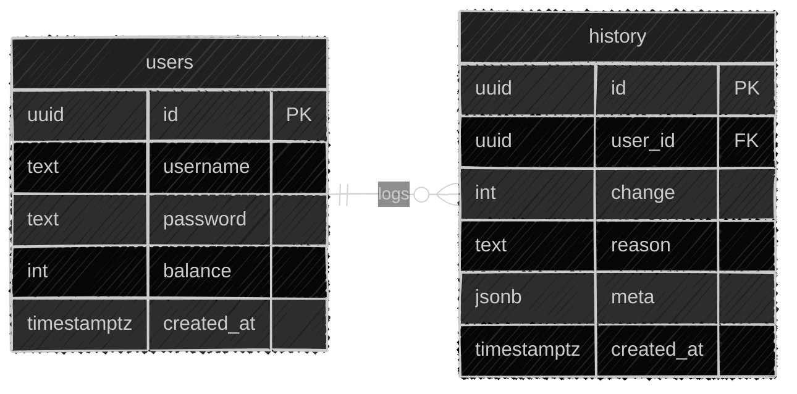
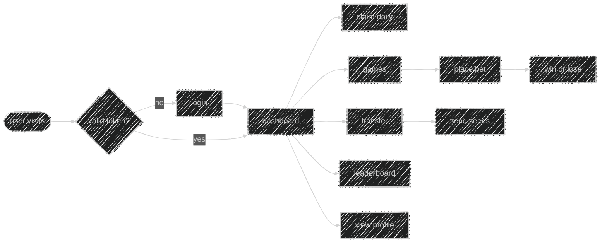

# 🌱 Seedbank


<br>


> [!CAUTION]
> 1. Frontend is still being built. Some pages may be missing or broken.
> 2. A database migration is planned, so any data you create will likely be wiped.

A fullstack web app where players earn, play minigames, and steal from each other over a highly valuable virtual currency. All just to look good on the leaderboard.

* Live App: https://seedbank-xi.vercel.app
* API Docs: https://seedbank-xi.vercel.app/api/docs

## ✨ Features

* Play different games (coinflip, dice, color, bomb, race)
* Steal other player's seeds
* Or be kind enough to give others your seeds
* Claim free rewards daily
* Stalk other player activity via `/users/username` route
* Compare yourselves through the leaderboard (by balance)
* A lot of bugs that im not even gonna fix

## 🧱 Tech Stack

| Technology | Purpose |
| --- | --- |
| Next.js | framework, routing, API routes |
| React | UI components |
| TypeScript | type safety |
| Tailwind CSS | styling |
| shadcn/ui | component library |
| Supabase (PostgreSQL) | database |
| jose | JWT auth |
| Zod + React Hook Form | validation |
| Axios | HTTP client |
| Scalar (OpenAPI) | API docs |
| Vercel | hosting, rate limiting |

## 🧠 Applied Concepts

* Applied SQL - remote database setup, modelling, queries
* REST API design - request/response contracts, status codes
* System Design Architecture - Seperation of concerns
* User auth - password hashing, JWT, protected routes
* Rate limiting - Vercel WAF
* React + Next.js - hooks, routing, server vs client components
* TailwindCSS + Shadcn - CSS, custom components

---

<details>
<summary>
    <h2>
    🛠️ Setup (for developers)
    </h2>
</summary>

#### 1. clone the repository

```bash
git clone <this repo>
cd seedbank
```

#### 2. set up supabase

* create an account at https://supabase.com
* create a project
* go to **sql editor**
* paste contents of `/database/schema.sql`
* run the query

#### 3. environment variables

create `.env.local`:

```
SUPABASE_URL=
SUPABASE_SERVICE_ROLE_KEY=
PASSWORD_HASH_ROUNDS=
JWT_SECRET=
```

#### 4. run locally

```bash
npm install
npm run dev
```

</details>

<details>
<summary>
    <h2>
    🪑 Project Design
    </h2>
</summary>


### Database

- every balance change updates `users.balance` and inserts a `history` row in the same service call
- `meta` is a nullable `jsonb` field for extra context like transfer recipient, steal target, etc.
- actions with no extra context (games, daily claim) leave `meta` as `null`



### System Architecture

- frontend sends validated values to the API initially
- API performs a final check upon receive
  - all server related errors are caught here and passed through a shared error response function
- service layer handles the actual logic (ex: handling transfers logic)
- database layer only performs queries


### Frontend Flow

- everything redirects to `/dashboard`
- no valid token redirects to `/login`
- dashboard is a shell navbar and a grid of action cards
- all games share a single `/api/play` endpoint, frontend only renders the result (boolean)
    - game logic, outcome, and balance update all happen server-side
    - the games are rigged and the users wont probably read this part lol (stated in tos.md as well)


