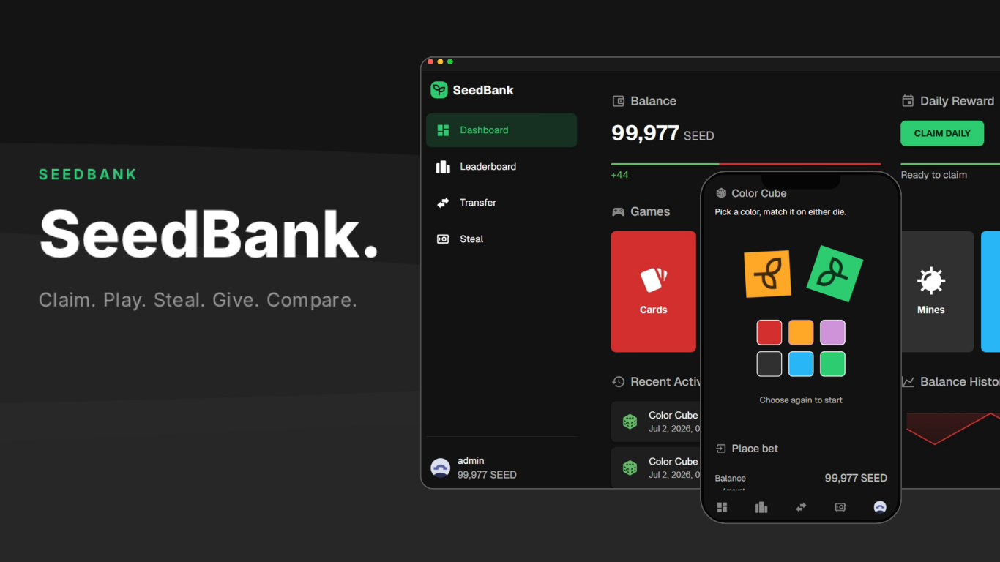

<h1 align="center">🌱 Seedbank</h1>

<p align="center">
A fullstack web app where players earn, play minigames, and steal from each other over a virtual currency.
</p>

<p align="center">
  
  
  
  
  
  
</p>

<p align="center">
  <a href="https://seedbank-play.vercel.app"><b>Live App</b></a> |
  <a href="https://seedbank-play.vercel.app/api/docs"><b>API Docs</b></a> |
  <a href="./docs/index.md"><b>Full Documentation</b></a>
</p>

<p align="center">
  
</p>

> [!NOTE]
> Seedbank uses a virtual currency with no real world value. It cannot be bought, cashed out, or exchanged for money. This is a learning project built to practice fullstack development, not a gambling product; see [Terms of Service](/public/TOS.txt) or the [FAQ](./docs/faq.md) for more.

> [!WARNING]
> The database may be paused, see [Supabase free tier limits](https://supabase.com/docs/guides/deployment/going-into-prod#availability)) 

## ✨ Features

- Play different games (card, coinflip, color cube, mines, roulette, slots)
- Win and lose SEEDs
- Steal from other players, or send them SEEDs instead
- Claim free daily reward
- Check other player activity through their profile page
- Compare standings on a public leaderboard

## ⚓ Tech Stack

| Technology | Purpose |
| --- | --- |
| Vercel | hosting, rate limiting |
| Next.js | framework, routing, API routes |
| Supabase | database |
| React | UI components |
| MUI | component library, theming |
| TypeScript | type safety |
| SWR | data fetching, caching |
| Axios | HTTP client |
| obscenity | profanity filtering |
| hCaptcha | bot protection on login and register |
| jose | JWT auth |
| bcryptjs | password hashing |
| Zod | schema validation |
| Scalar (OpenAPI) | API reference |
| Vitest | testing |
| Anime.js | animations |
| Howler | sound effects |
| canvas-confetti | win celebration effects |


## ⚡ Applied Concepts

- SQL: remote database setup, schema design, queries
- REST API design: request and response contracts, status codes
- Layered architecture: separation between API, service, and database concerns
- User auth: password hashing, JWT, protected routes
- Rate limiting at the edge
- React and Next.js: hooks, routing, server vs client components
- Input validation and sanitization on both client and server
- Error normalization: a shared error map and response shape across all routes
- Automated testing with Vitest across services and API routes
- API documentation via OpenAPI, generated from Zod schemas

## 👨‍🍳 Development

Clone the repo and install dependencies with [pnpm](https://pnpm.io):

```bash
git clone <this repo>
cd seedbank
pnpm install
pnpm run dev
```

Full setup, including Supabase and environment variables, is covered in [docs/dev-setup.md](./docs/dev-setup.md).

---

For architecture, design decisions, FAQs, and everything else, see [docs/index.md](./docs/index.md).
