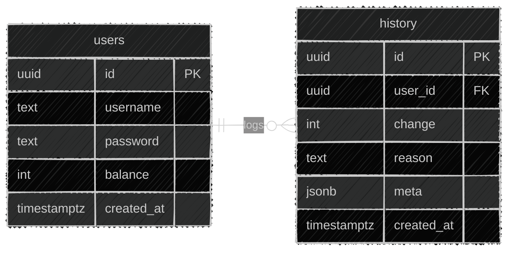

# Database

## Why Supabase

[Supabase](https://supabase.com/) is free and easy to set up, and it uses PostgreSQL under the hood. The goal here was to learn a classic database connection rather than lean on Supabase's higher level features, so the setup is intentionally basic.

## Schema

Two tables. Every balance change updates `users.balance` and inserts a matching `history` row in the same service call, so a balance can always be traced back to what caused it.

- `users`: id, username (unique), password (hashed), balance, created_at
- `history`: id, user_id, change (positive for a gain, negative for a loss), reason, meta, created_at
  - `reason` follows a namespaced format, such as `DAILY`, `GAME:COINFLIP`, or `TRANSFER:SENT`
  - `meta` is a nullable jsonb field for extra context, like the counterparty username on a transfer or steal. Actions with no extra context leave it null

---

[Back to docs/index](/docs/index.md)